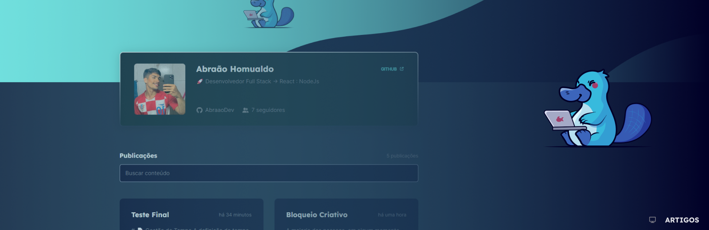

<h1 align="center">
    
</h1>

## Tela - Artigos PET

<p align="center">
  <span>Projeto desenvolvido para ser uma Tela de Artigos aprovados e postados, pelo PET Computação UFPB. Em breve mais telas serão adicionadas e novas funcionalidades.
   <br>
   <br>
    🚀 NEVER STOP LEARNING!
  </span>
</p>

<br>

## 🧪 Technologies

This project was developed using the following technologies:

- [ViteJs](https://vitejs.dev/)
- [ReactJs](https://reactjs.org)
- [TypeScript](https://www.typescriptlang.org/)
- [StyledComponents](https://styled-components.com)

## 🚀 Getting started

Clone the project and access the folder

```zsh
$ git clone https://github.com/abraaodev/artigosPET.git && cd artigosPET
```

Follow the steps below

```zsh
# Install the dependencies
$ yarn
# Start the project
$ yarn dev
```

## 💻 Project

[ArtigosPET] came to remind you to exercise always! 🔥 <br>

<div align="center" ><a href="https://artigos-pet.vercel.app/" target="blank"> Click here and see the Application Deployment</a>
</div>

## 📝 License

This project is licensed under the MIT License. See the [LICENSE](LICENSE.md) file for details.

---

<p align="center">Made with 💜 by Abraão DEV</p>
